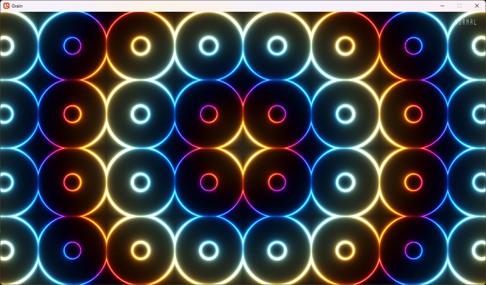

# Grain

This is a small proof of concept for using MonoGame without touching the graphical MGCB editor.  
This project uses the NuGet package `MonoGame.Content.Builder.Task` to automatically compile assets (in this project's case, a shader) during the build process.  
For some reason, setting the output and intermediate paths by using the `/outputDir` and `/intermediateDir` parameters in the content manifest didn't work so I had to overwrite the MSBuild variables using a `Target`:
```xml
<Target Name="AdjustMonoGameContentPipeline" AfterTargets="CollectContentReferences">
    <ItemGroup>
        <ContentReference>
            <ContentOutputDir>$(OutputPath)Content</ContentOutputDir>
            <ContentIntermediateOutputDir>$(IntermediateOutputPath)Content</ContentIntermediateOutputDir>
        </ContentReference>
    </ItemGroup>
</Target>
```

The shader itself was written with the help of this video: [An introduction to Shader Art Coding](https://www.youtube.com/watch?v=f4s1h2YETNY).

# Screenshot


